{: .fs-2 }
This document was last modified: <scr id="demo">.

# Lab 0: Software Installation
{: .no_toc }

## Table of contents
{: .no_toc .text-delta }

1. TOC
{:toc}

---

## Lab Objective

This lab`s objective is to prepare you for the different upcoming labs of Robotic System courses 
by installing the necessary software. While this lab has no grade value, it is meant to help 
prevent future delays caused by needing to stop and install these software programs later.

## Deliverable

- [ ] Nothing needs to be submitted or demonstrated for this lab.

## General Steps for Completion of Lab

### Step 1 - Install PSoC Creator

To Hide Details

The CY8CKIT-059 PSoC 5LP Development Boards need the PSoC Creator™ Integrated Design Environment (IDE) for programming. You will 
need to go to <https://www.infineon.com/cms/en/design-support/tools/sdk/psoc-software/psoc-creator/> to download this software. 

The link will open to a page like <strong>Figure 1</strong>. Click the Download icon that the yellow arrow is pointing to.

<figure>
    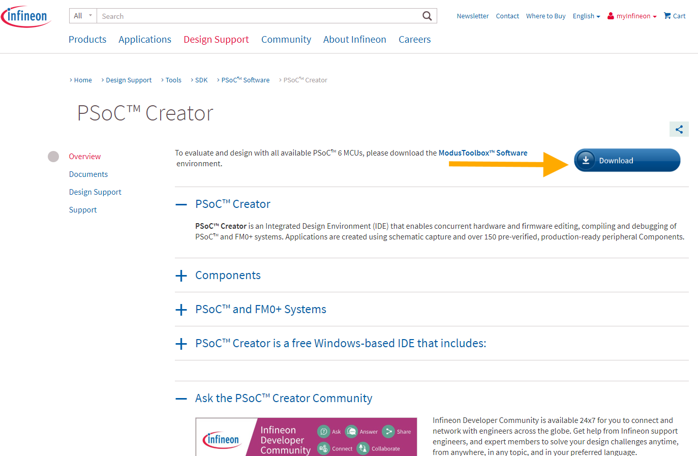PSoC Creator</strong> download web page and where to find the download button.">
    <figcaption><strong>Figure 1:</strong> Showing the <strong>PSoC Creator</strong> download web page and where to find the download button.</figcaption>
</figure>  

Then another window will open to verify the operating system and version of PSoC Creator you want to download, as 
shown in <strong>Figure 2.</strong>

{: .new-title}
> Note
> 
> While <strong>Figure 2</strong> shows version a version of <strong>4.4</strong> for <strong>PSoC Creator</strong>, 
> you can use the current version if there is a newer one available.

<figure>
    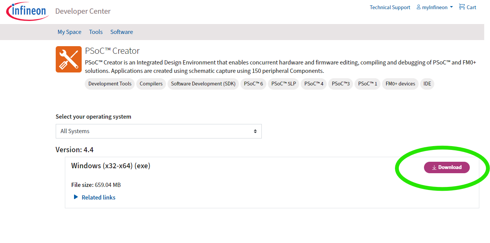
    <figcaption><strong>Figure 2:</strong> This is the next window that shows the operating system and software version before the download.</figcaption>
</figure> 

Before downloading, it will ask you to log into <strong>Infineon</strong>, as shown in <strong>Figure 3.</strong>. You 
will need to sign into your account or create a new one.

<figure>
    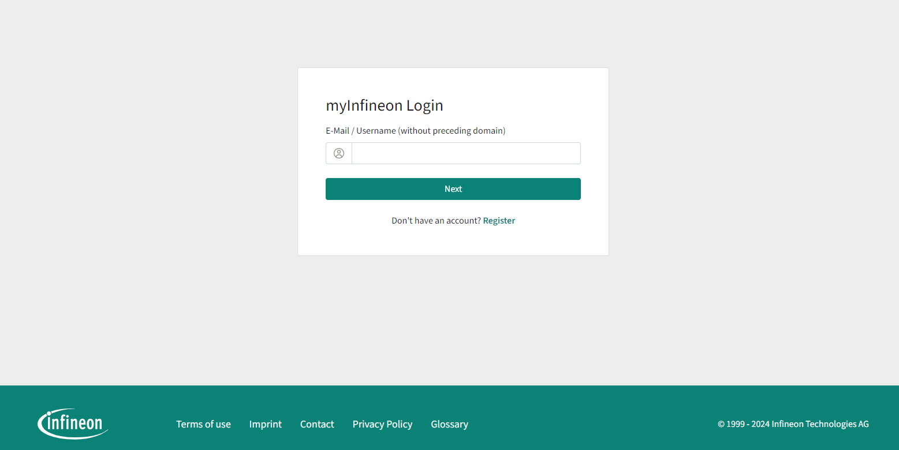
    <figcaption><strong>Figure 3:</strong> Showing the request to log in to a <strong>Infineon</strong> account.</figcaption>
</figure> 

The first step is to verify where to install the PSoC Creator, as shown in <strong>Figure 4.</strong> You 
can either accept the default location or change it.

<figure>
    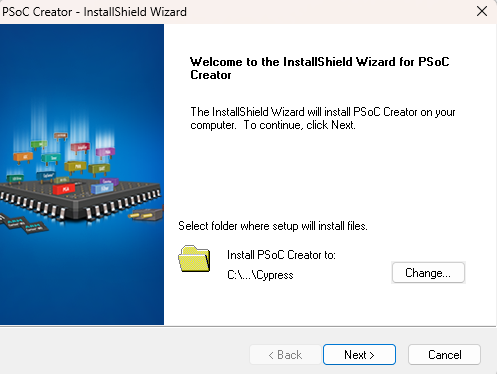
    <figcaption><strong>Figure 4:</strong> Showing the save software location verification.</figcaption>
</figure> 

The second item to decide on is the “Installation Type” you want to install. We will go with <strong>Typical</strong> 
as shown in <strong>Figure 5.</strong>

<figure>
    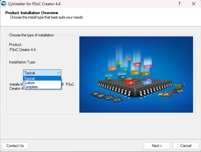
    <figcaption><strong>Figure 5:</strong> Showing the recommended type of installation of <strong>PSoC Creator</strong>.</figcaption>
</figure> 

Then, it will ask you to accept the terms of the two license agreements as shown in <strong>Figure 6.</strong>

<figure>
    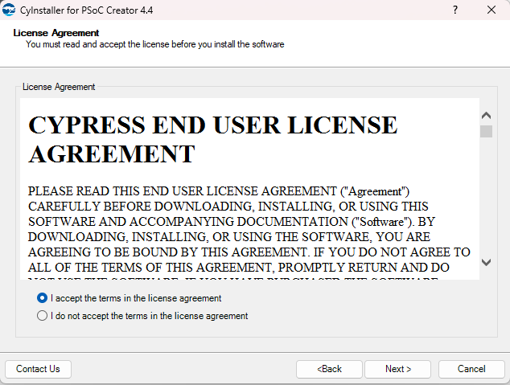
    <figcaption><strong>Figure 6:</strong> Showing the one of the two License agreements you will need to agree to.</figcaption>
</figure>

Finally, the software will begin to install.

<figure>
    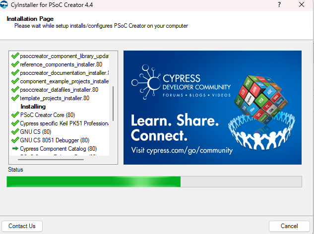
    <figcaption><strong>Figure 7:</strong> Showing a moment in the progress of installing the software.</figcaption>
</figure>

When the installation is finished, you have a few choices on how you want to <strong>Finish</strong> as 
shown in <strong>Figure 8</strong>.

<figure>
    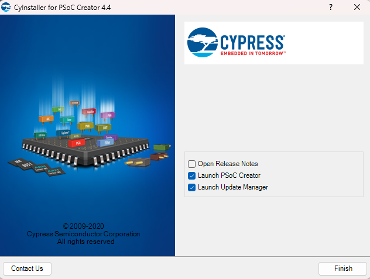
    <figcaption><strong>Figure 8:</strong> Showing the final install window with the options on how you want to “finish” the install process.</figcaption>
</figure>

### Step 2 - Install Python 

To Hide Details

To handle some of the heavier processing that will come later in these courses, we will be using Python. You 
will need to go to < https://www.python.org/downloads/> and download the version that works with your computer 
type, like what is shown in<strong>Figure 9<strong>.

<figure>
    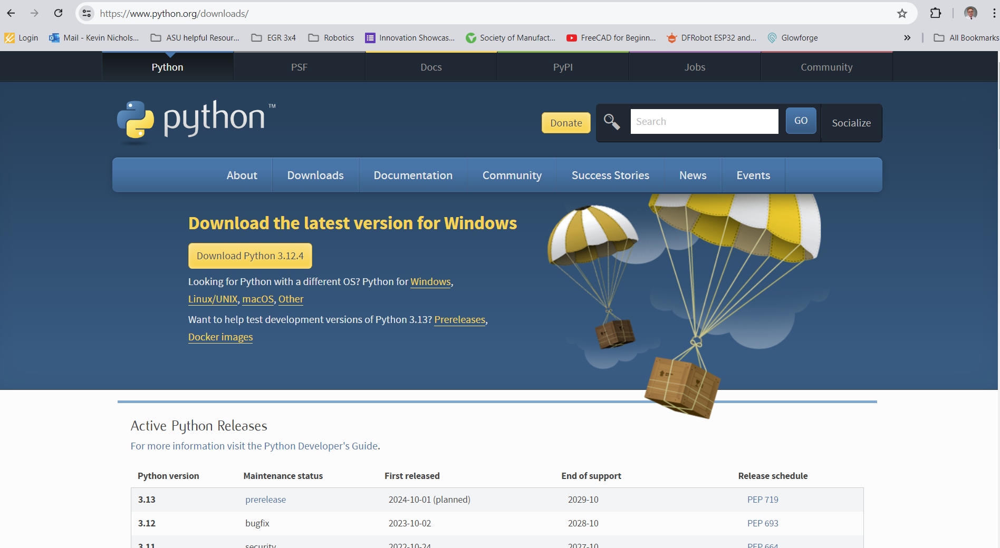
    <figcaption><strong>Figure 9:</strong> Showing the Python download page.</figcaption>
</figure>

After downloading the program, go ahead and run the install software. The <strong>first option</strong> you will 
have when installing will be whether you are installing for <ins>all users</ins> or <ins>just for you</ins> as 
the user you are currently signed in as. Click <strong>Next</strong> after making your selection.

The next option will be the <strong>Destination Directory</strong> location. Before selecting <strong>Next</strong>, 
take a moment to <ins>look at and <strong>remember</strong> the location</ins> you will have Python installed.

The following screen will be the <strong>Customize Python</strong> options. Scroll down the list till you 
find “<strong>Add python.exe to Path - Entire feature will be installed on local hard drive.”</strong> After 
selecting it, click <strong>Next</strong> and wait for the software to finish installing. When complete, you 
can close the Install software by selecting “<strong>Finish</strong>.”

### Step 3 - Install Python's Library “NumPy” 

To Hide Details

If you were to open <strong>Python IDLE</strong> right now and enter a single line of a simple math problem, 
like 13 + 31, and hit <strong>Enter</strong>, Python will return the answer. But when you enter a simple 
trigonometry problem like sin(90), you will get an “<ins>NameError</ins>.” This is because a Python 
library called <strong>NumPy</strong> does not automatically when Python was installed.

NumPy (Numerical Python) is an open-source Python library widely used in science and engineering. It works with 
arrays and has functions for linear algebra, Fourier transform, and matrices.

There are several ways to install NumPy. You can go to <https://numpy.org/install> to see several of these methods. 
I used the <strong>PIP</strong> method to install <strong>NumPy</strong> into <strong>Python</strong> in just a couple of steps.

The first step is to open the computer`s <strong>Command Prompt</strong> window by typing CMD in the program search, 
similar to what is shown in <strong>Figure 10</strong>.

<figure>
    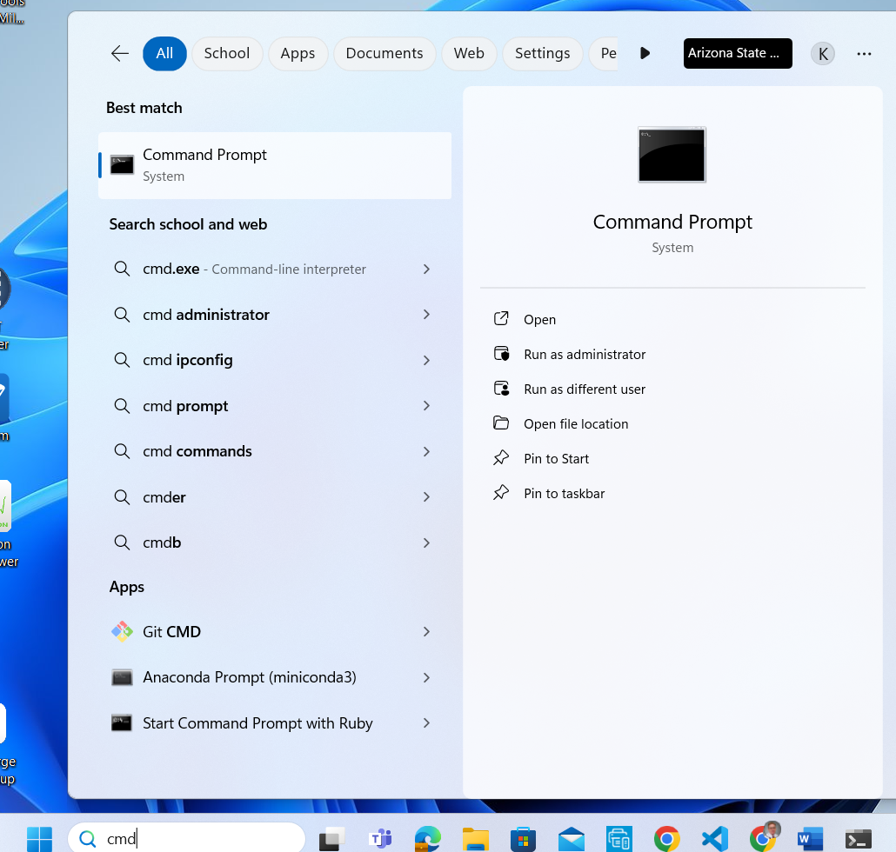Command Prompt</strong> window.">
    <figcaption><strong>Figure 10:</strong> Show98765432 34567nload page.</figcaption>
</figure>

Once the <strong>Command Prompt</strong> opens, type <ins>“pip install numpy”</ins> and then <strong>Enter</strong> 
to start the installation process. After a few moments, you should get a message that it was successfully installed. 
Something like what is shown in <strong>Figure 11</strong>. After the installation process has finished, go ahead 
and close the <strong>Command Prompt</strong> window. 

<figure>
    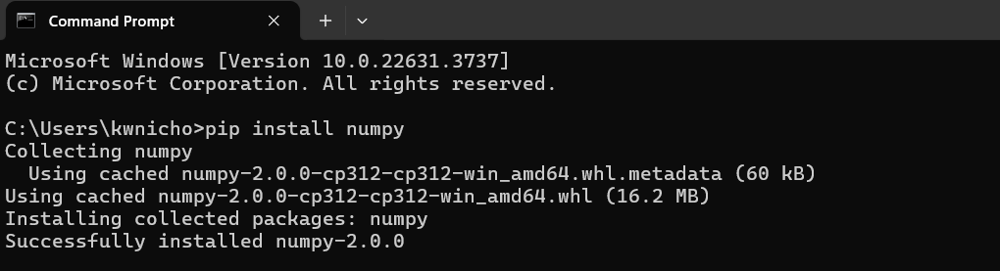NumPy</strong> via the Command Prompt.">
    <figcaption><strong>Figure 11:</strong> Showing an example of the complete PIP install of <strong>NumPy</strong> via the Command Prompt.</figcaption>
</figure>

After you have installed the NumPy library, it is a good idea to check that it was installed correctly so that a 
bad installation does not cause trouble later. Open <strong>Python IDLE</strong> program and enter a single-line math 
problem, like 13 + 31 into the <strong> IDLE Shell</strong> window and hit <strong>Enter</strong>. If you entered 13 + 31, 
Python returns the answer of 44. Now to check that the NumPy library got installed, type <ins>”import numpy as np”</ins> in 
the new line of the Shell window and then <strong>Enter</strong>. If there was no problem with the NumPy installation, 
you should just get a new line. Now to check the trigonometry function of sine, type “<ins>np.sin(90)</ins>” and enter. 
You should get the radiant number of the sine of 90 degrees. <strong>Figure 12</strong> shows my results for this NumPy 
installation check.

You will learn more about using Python in future lab lessons.

<figure>
    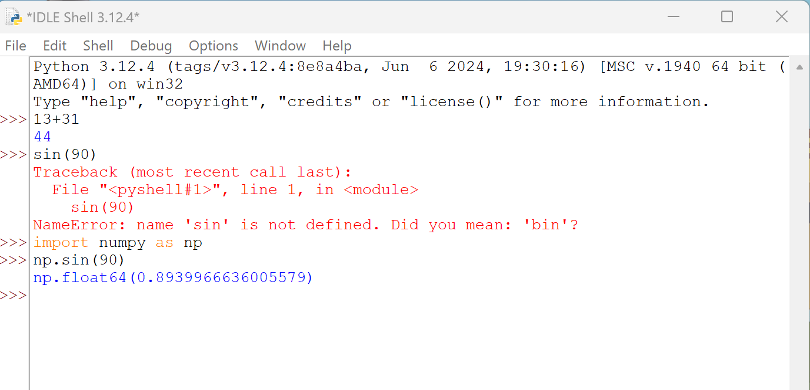
    <figcaption><strong>Figure 12:</strong> Showing Python working after installing and importing NumPy.</figcaption>
</figure>

