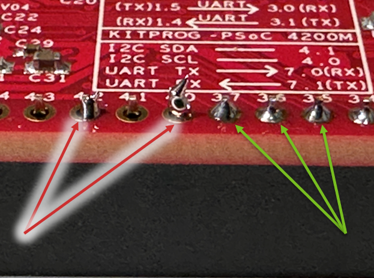

{: .fs-2 }
This document was last modified: <scr id="demo">.

# Lab 1: Hello Controller
{: .no_toc }

## Table of contents
{: .no_toc .text-delta }

1. TOC
{:toc}

---

## Lab Objective

To learn something

## Deliverable

Demostrate a assembled Robotic System's "Controller" and you got the LCD screen to display the modified message. 

## Guide on lab

### Step 1

Read More

start
start
start

start
start

start
start
start

start
start

start
start

### Step 2

Read More

do
do

<figure>
    
    <figcaption>Fig: Example of Good and Bad Soldering.</figcaption>
</figure>

do
do
do
do

do
do
do

do
do

### Step 3

Read More

that
that
that

that
that

that
that
that

