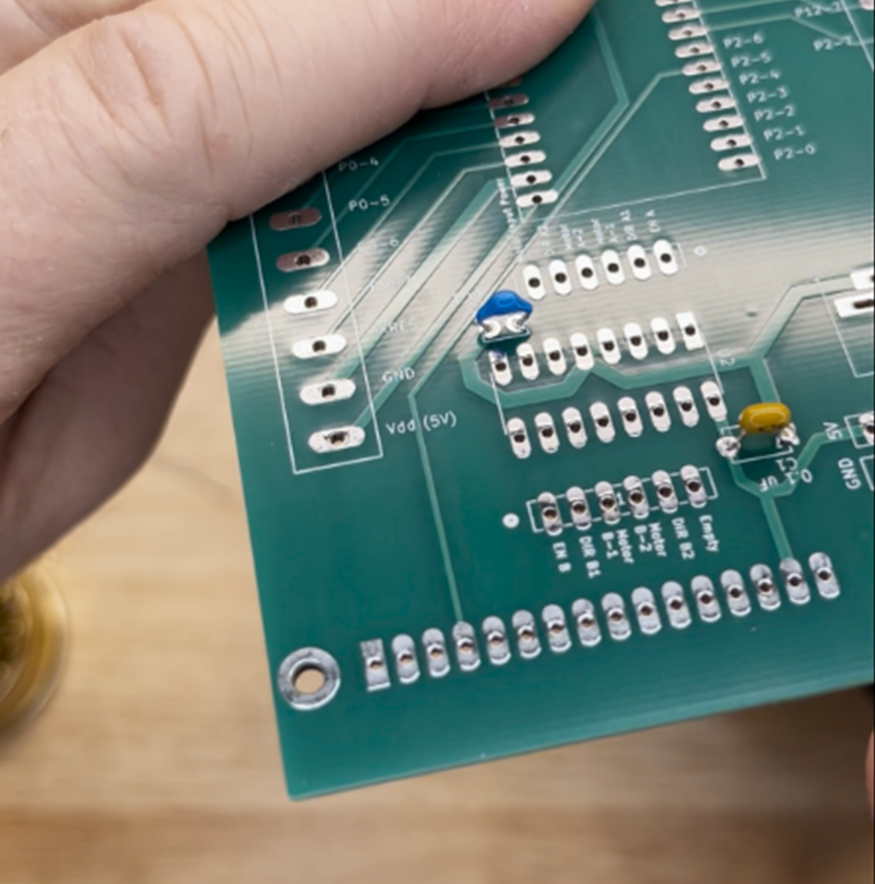
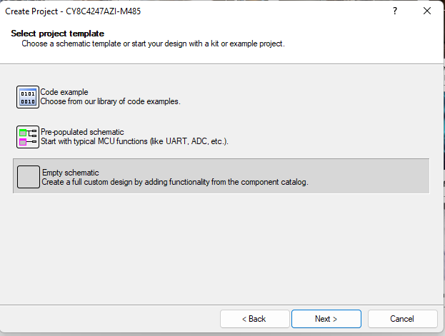
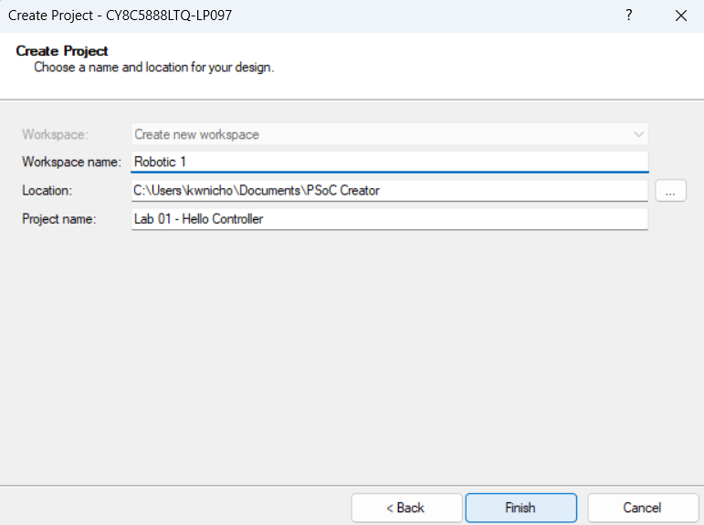
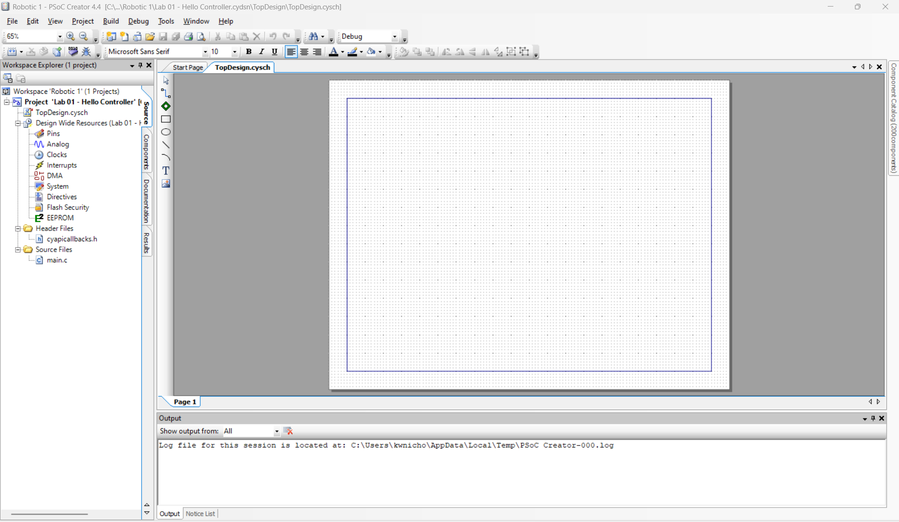
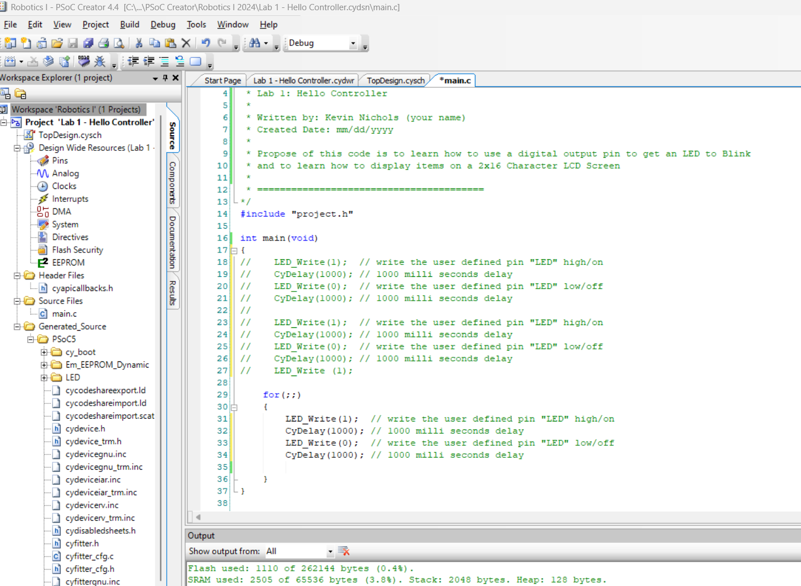

{: .fs-2 }
This document was last modified: <scr id="demo">.

<script>
let text = document.lastModified;
document.getElementById("demo").innerHTML = text;
site.last_edit_timestamp= text;
</script>

# Lab 1: Hello Controller
{: .no_toc }

## Table of contents
{: .no_toc .text-delta }

1. TOC
{:toc}

---

## Lab Objectives

1.	Ensure that you are ready to use the Robotic System`s mock Controller unit, which uses PSoC 5LP
and an LCD Screen, for many of the lab assignments.
2.	Get you started with some coding on the PSoC controller.

## Deliverables

- [ ] <ins>In-class demonstration</ins>, using your completed "controller" indicated by writing your name on
    the back side of the PCB, display your name in the top left corner of the LCD screen
    and towards the bottom right corner of the LCD screen, you have “Count:” with values counting up by ones.

- [ ] <ins>In-class demonstration</ins> of the PSoC`s built-in LED blinking.  

- [ ] <ins>A Canvas submitted</ins> of the Lab`s PSoC Creator archived/zipped file for this lab.

{: .warning-title}
> Warning
>
> <Strong><ins>To be eligible</ins></strong> to receive credit for the code submission,
> you <strong><ins> must receive Demonstration credit.</ins></strong>


## General Steps for Completion of Lab

### Step 1 - Double Check Parts 
<details open markdown="block">
<summary>To Hide Details</summary>

The following table lists the parts, quantities, and PCB 
designators. <strong>Figure 1</strong> shows a view of most of the parts needed to build mock controller 
for the Robotic Systems courses.

| QTY  | Part Name                     |PCB designator(s) |
|:------|:-----------------------------|:-----------------|
| 1     | Custom PCB                   |                  |
| 2     | 40 pin Female Header         | U1               |
| 14    | 4 pole Screw Header          | J1 (6.5x), J2(2x),<br> J9 (5x), J8 (0.5x)              |
| 1     | DC Power Jack                | J6               |
| 1     | 16 pins IC Socket            | U2               |
| 2     | 6 pin Female Header          | J11, J12         |
| 1     | 0.1 uF Capacitor (104)       | C1               |
| 1     | 1 uF Capacitor (105)         | C2               |
| 2     | 4 pin Female Header          | J7, J10          |
| 1     | 16 pin Female Header         | U3               |
| 2.5   | 40 pin Male Header           |                  |
| 1     | PSoC 5LP Development Kit     |                  |
| 1     | Basic 16x2 Character LCD     |                  |
| 5     | Bumper Pads     |  ** To provide protection for accidental shorts and/or scratches from PCB   |
| 4     | Socket Head Screw<br> M2.5, 14 mm Long     | ** Use to attach LCD Screen to PCB if so desired. |
| 8     | M2.5 Nylon Hex Nut    | ** Use to attach LCD Screen to PCB if so desired.   |

<figure>
    
    <figcaption><strong>Figure 1:</strong> Parts needed to build mock controller.</figcaption>
</figure>  

</details>

### Step 2 - Solder Parts
<details open markdown="block">
<summary>To Hide Details</summary>

Solder the different parts on to build your "Controller," similar to what is shown in <strong>Figure 2.</strong> See below for more details and steps.

<figure>
    
    <figcaption><strong>Figure 2:</strong> Showing the completed mock controller.</figcaption>
</figure>

{: .new-title}
> TIPS
> <ul>
>   <li> When soldering through-hole parts, it is commonly recommended that solder 
>   parts be attached in order of smallest height to largest.</li>
>   <li> Place/work with parts to help keep the PCB “level” to help keep parts tight to the board.</li>
>   <li> Solder one (or two, if needed) to hold the part in place so you can inspect and
>   correct the positioning before soldering all the pins.</li>
>   <li> Both the pad and pin need to get hot so that the solder flows and bonds correctly.</li>
>   <li> Too much heat for the type of solder can ruin the solder joint(s).</li>
>   <li> When part alignment matters, place all the parts and then solder a few pins to hold the 
>   alignment. Then, if applicable, separate into a sub-group before finishing the soldering
>   of the remaining pins. Check and be careful not to mess up that alignment.</li>

Using the tip from above, it is recommended that you add parts in the following order:
1.	Capacitors. (<strong>Figure 3</strong> for refernce shown farther below)
2.	Dip socket. (<strong>Figure 4</strong>)
    * <strong> Make sure <ins>the notch</ins> on one of the short ends of the DIP socket is <ins>next to the U2 marking</ins>.</strong>
    This notch indicates how the IC chip get inserted in where both notches are together. This notch is clearer to see in
    in <strong>Figure 6.</strong>
3.	Female and male headers at U1 (PSoC). (<strong>Figure 5</strong>)
4.	Remaining female headers at J7, J10, J11, J12, and U2. (<strong>Figure 6</strong>)
5.	Screw headers, connected together at J1 and J9.
6.	Remaining screw headers.
7.	DC Power Plug.
8.	Male header to LCD screen.
9.	Bumpers on the back side of PCB.


{: .warning-title}
> Attention!
>
> Make sure the opening on the side of the screw terminals are
> facing out, away from PCB, to make it easy to secure wires later.
> (<strong>Figure 7</strong> for refernce shown farther below)


<figure>
    
    <figcaption><strong>Figure 3:</strong> Showing the placement of capacitors.</figcaption>
</figure>
<br>
<figure>
    
    <figcaption><strong>Figure 4:</strong> Showing the placement of dip socket.</figcaption>
</figure> 
<br>
<figure>
    
    <figcaption><strong>Figure 5:</strong> Showing male and female headers held in alignment with PSoC Dev board.</figcaption>
</figure>
<br>
<figure>
    
    <figcaption><strong>Figure 6:</strong> Showing remaining female header.</figcaption>
</figure>
<br>
<figure>
    
    <figcaption><strong>Figure 7:</strong> Attempting to Show how the wire openings on the screw termials are facing out.</figcaption>
</figure>
<br>

</details>
### Step 3 - Inspection of Work
<details open markdown="block">
<summary>To Hide Details</summary>

If you haven`t been doing it already, now is the best time to inspect your work on
assembling your “Controller.” Things you are on the lookout for are:
<ul>
    <li> Missed parts. Look for parts you may have forgotten to either add or fully solder.
    The only opening that will not have something soldered to it are the non-plated mechanical
    holes for the screws to mount/secure the LCD screen.</li>

    <li> Quality of soldered joints. Look at all the points you soldered. (a) Do they have 
    the appearance of a slightly melted Hersey kiss? This means that the solder flows in a smooth
    cone-like shape. See <strong> Figure 8</strong> and look at the solder joint the Green arrows
    are pointing to for reference. Or look at the solder joints back in <strong>Figure 7. </strong>
    You <strong><ins>do not want balls</ins> of solder at the pins</strong> like the what the
    <strong> RED arrows</strong> are pointing to in <strong>Figure 8.</strong> </li>

    <li> Check continuity. While inspecting your solder joints, are there places you 
    are <strong> not certain</strong> they are either (a) making a connection or (b) could be 
    shorting? Now is the time to make sure you will not have problems later. </li>
</ul>

<figure>
    
    <figcaption><strong>Figure 8:</strong> Attempting to show how to check solder joint quality where 
    the green arrows are what is desired.</figcaption>
</figure>


</details>
### Step 4 - Understanding Your Controller

#### Processor
{: .fs-4 .fw-500}
<details open markdown="block">
<summary>To Hide Details</summary>

Similar to an Industrial Controller Unit, your mock Robotic System's Controller
has a Processor which is the PSoC 5LP, which is within the Orange 
center box of <strong>Figure 9.</strong>  To protect our processor, the whole Dev board
is supported by header to help prevent the kit's programmer section from snapping/breaking 
off from the PSoC 5LP section. <strong>Figure 10</strong> shows those two sections and a pin overview of the PSoC 5LP. 

{: .warning-title}
> Warning!
>
> You can only program this Dev board on the one end with the male USB A 
> through the programmer section of the dev board.

<figure>
    
    <figcaption><strong>Figure 9:</strong> Highlighting the location of the processor with the orange box 
    and the in/output connector with the two red boxes.</figcaption>
</figure>
<br>
<figure>
    
    <figcaption><strong>Figure 10:</strong> PSoC 5LP pin overview and section.</figcaption>
</figure>
</details>

#### Inputs and Outputs
{: .fs-4 .fw-500}

<details open markdown="block">
<summary>To Hide Details</summary>
Again, like an Industrial Controller Module, the different
Input and Output that goes to the processor have a separate connection for
easy and secure points of connection. These are in located in the red boxes of 
<strong> Figure 9.</strong> The only I/O pins for the PSoC 5LP not on these screw terminal blocks 
are the ones going to the LCD screen.
</details>

#### Shared Processor Power Levels
{: .fs-4 .fw-500}

<details open markdown="block">
<summary>To Hide Details</summary>

For any of the devices that will be connected to the controller and will be using the same 5 volts, 1/2 
an amp power as the PSoC 5LP, there are the two, 5-pin headers indicated by the yellow box in 
<strong>Figure 11</strong> below. In addition to these headers, there are two set of locations within the screw 
terminal connectors. One set is at the end of screw terminal connectors opposite of the DC power jack and 
close to the LCD screen. The other set is diagonal to the first noted set, next to the 
V<sub>bus</sub> input power connection.

{: .new-title}
> Note
>
> All power sources have their grounds connected together via a Ground Plane within the PCB board to help you not experience that issue of things 
> not working because the grounds were not tied together. (You’re welcome. I hope because this a lesson <strong><ins>you must learn</ins></strong> and 
> most <ins><strong>ready learn </strong> it the hard way</ins>.)

<figure>
    
    <figcaption><strong>Figure 11:</strong> The yellow box indicates a point of connection for multiple 5 volts and ground connections.</figcaption>
</figure>

</details>

#### Motor Driver Unit
{: .fs-4 .fw-500}

<details open markdown="block">
<summary>To Hide Details</summary>

Just like an Industrial Controller, our Robotic System’s Controller processor cannot handle the 
higher voltage and amperage levels that the motor needs to have to operate without causing damage 
to the processor. To safely control the motor at a higher level than the processor, the processor 
communicates with some type of motor controller device. Your kit has been designed to do this with 
an H-Bridge IC chip. The H-Bridge chip sits in the dip socket and has the needed connections either 
directly handled with traces within the PCB or to the two headers on either side. We are using a 
dip socket connection instead of soldering the IC to the PCB for ease of possible repair. These headers 
and dip socket for our motor driver unit is indicated by the orange box in <strong>Figure 12.</strong>

<figure>
    
    <figcaption><strong>Figure 12:</strong> The orange box indicates the motor driver unit area.</figcaption>
</figure>

</details>

#### Motor Power
{: .fs-4 .fw-500}

<details open markdown="block">
<summary>To Hide Details</summary>

To provide a higher voltage and amperage level for the different motors that will be used in the course, 
there is the DC power jack along with 4 sets of screw connectors. These have been identified by the 
red “box” in <strong> Figure 13.</strong>

<figure>
    
    <figcaption><strong>Figure 13:</strong> The red box area indicates where the higher motor power comes in and is accessed.</figcaption>
</figure>

</details>

#### User Interface Screen
{: .fs-4 .fw-500}

<details open markdown="block">
<summary>To Hide Details</summary>

To handle the feedback, one may that a simple indicator light cannot do, a user interface screen is 
commonly employed. You have been provided with a 2-by-16-character LCD screen that the PCB has the 
different connection handled for you so that it is a simple process to connect the LCD screen when 
needed/desired whose location is indicated in <strong> Figure 14</strong> by a red box. While you 
will not be asked to use to in all the upcoming labs, you may find it a useful tool for debugging.

<figure>
    
    <figcaption><strong>Figure 14:</strong> The red box area indicates where a display screen can be connected.</figcaption>
</figure>

</details>


### Step 5 - First Code in PSoC

#### Create a Workspace and Start a Project
{: .fs-4 .fw-500}

<details open markdown="block">
<summary>To Hide Details</summary>

If you have <strong><ins>not installed PSoC Creator</ins></strong> as part of <strong>Lab 0</strong>, 
you will need to go back and do so before moving forward.

Open PSoC Creator. While opening the program, you might get a pop-up screen that ask to register 
or allow “cykeilic” app to make changes as shown in <Strong>Figure 15.</strong> You can just say 
no to this request if you so desire. When the program opens, your screen will look something like 
<strong>Figure 16.</strong>

<figure>
    
    <figcaption><strong>Figure 15:</strong> Showing the pop-up screen that asks to register or allow “cykeilic” app to make changes.</figcaption>
</figure>
<br>
<figure>
    
    <figcaption><strong>Figure 16:</strong> Showing the home screen of PSoC Creator after launching it and without opening any project or workspace files.</figcaption>
</figure>
<br>

Now to start the process of creating a new project in a new workspace, select 
<strong>File</strong> -> <strong>New</strong> -> <strong>Project</strong> as show in 
<strong>Figure 17</strong> from the pull-down menu. 

<figure>
    
    <figcaption><strong>Figure 17:</strong> Showing a visual reference to starting a new project.</figcaption>
</figure>
<br>

The first step in creating a new project will be to choose the type of project to create as shown 
in <strong>Figure 18.</strong> Select “Target Device”: <strong>PSoC 5LP</strong> 
and “<strong>Launch Device Selector</strong>.” The “Device Selector” window will open. To narrow 
the search list, type “<strong>CY8C58LP</strong>” into the “Series” Filters input. This took my 
list down to 19 to choose from with “<strong>CY8C5888LTQ-LP097</strong>” being the last one on the 
list. Find and select “<strong>CY8C5888LTQ-LP097</strong>” on your list, then 
click <strong>OK</strong>. 

<figure>
    
    <figcaption><strong>Figure 18:</strong> Showing and providing visual reference to the “Select Project Type” step in creating a new project.</figcaption>
</figure>
<br>

The “Device Selector” window will close so that you are back the previous window of “Select 
Project Type.” If the filled-in “Target device” is updated to the selection, then select <strong>Next.</strong>

A new window of “<strong>Select project template</strong>” will open as shown in <strong>Figure 19.</strong> Select 
"<strong>Empty Schematic</strong>" and then <strong>Next.</strong>

<figure>
    
    <figcaption><strong>Figure 19:</strong> Showing the project template window that will appear as you create a new project.</figcaption>
</figure>
<br>

The last step in creating a project is to give it a name, a workspace name, and location to where 
you want to save the project.

<ul>
	<li> <strong>Workspace</strong> is way of grouping several projects together. I will
    suggest calling it Robotic 1.</li>
	
    <li><strong>Project</strong> is the current/local code group that is within a Workspace. You 
    can open and access all the projects that are within a given Workspace. When you have multiple 
    projects, you will need to select/check which project is active when you go to program the 
    PSoC. (More on that later.)</li>
</ul>

{: .new-title}
> Note
>
> While it will be shown that all labs for Robotic Systems I in one “Workspaces” folder 
> and Robotic Systems II in another, you can choice how to keep all the project files 
> organized. Having a main Workspace with different projects that have some connection between 
> them is more organized and will allow you to open several project files to view/copy from as 
> reference to the current project. The other option is a new workspace for every new project.

<br>
<figure>
    
    <figcaption><strong>Figure 20:</strong> Showing the suggested naming for your Workspace and Project.</figcaption>
</figure>
<br>

PSoC Creator will then build you a project and when it finishes, your screen will look 
something like <strong>Figure 21.</strong>

<figure>
    
    <figcaption><strong>Figure 21:</strong> Showing the screen image of your freshly created project.</figcaption>
</figure>

</details>

#### Connect and Verify Project Setup
{: .fs-4 .fw-500}

<details open markdown="block">
<summary>To Hide Details</summary>

Before going to far, to will be good to check that your first project got setup correctly. To do this, 
connect the PSoC to the computer you are using with a USB cable. On the PSoC connection side, you 
need to plug the USB cable onto the PSoC so that the little white spacer is touching the copper 
pads as shown in <strong>Figure 22.</strong> When connected, the PSoC will have LEDs on and blinking.

<figure>
    
    <figcaption><strong>Figure 22:</strong> Showing how to connect the USB cable to make connection with the PSoC.</figcaption>
</figure>
<br>

Now let us program the PSoC with this blank project to check if the set-up is correctly so far. To 
program the PSoC, select the “<strong>Program</strong>” icon. <strong>Figure 23</strong> show what 
that icon looks like and possibly where it might be located. If everything has been done correctly 
up to this point, the PSoC 5LP will get programmed without errors and the LED will stop blinking. Additionally, 
in the “<strong>Output</strong>” window, it will tell you that it was <ins>successfully programmed</ins>.

<figure>
    
    <figcaption><strong>Figure 23:</strong> Showing what the program icon looks like and possible where it could be located.</figcaption>
</figure>

</details>

#### Introduction to PSoC Coding Environment
{: .fs-4 .fw-500}

<details open markdown="block">
<summary>To Hide Details</summary>

<figure>
    
    <figcaption><strong>Figure 24:</strong> Introduction to some of the key parts of PSoC Creator program.</figcaption>
</figure>
<br>

To help you navigate around PSoC Creator, look at the different colored boxes in <strong>Figure 24.</strong> 
There are four main areas you will be dealing with within PSoC Creator for the programming the 
PSoC 5PL in the Robot Systems labs.
<ol>
    <li> “<strong> TopDesign</strong>” - This is where all the component modules will be places and
     setup acquired to the need. It is generally the tab that opens up when you start a project. If 
     it gets closed, you can reopen it by double clicking on it. You can find it right under the 
     project name as shown by the orange box in <strong>Figure 24.</strong> </li>

     <li> “<strong> Component Catalog</strong>” - The green box in <strong>Figure 24</strong> shows 
    where this is located. It is here where you will find all the components modules/blocks are 
    located which you can use in programming. You can search for it by typing in the name or open 
    and look under sections you think it might be located. To use a component module, you select it 
    and then drag it onto the “TopDesign” page. </li>

    <li> “<strong>Pins</strong>” - The small teal box under the “TopDesign” in <strong>Figure 24</strong> 
    shows where one can access the pin allocations. When open, this is where you assign the 
    I/O pins of the modules you placed in the “TopDesign” to the pins of the PSoC chip. </li>

    <li> “<strong>main.c</strong>” - This is where the ‘C’ code gets written and is show within the 
    red box in <strong>Figure 24.</strong> </li>

</ol>

Other things to notice in <strong>Figure 24</strong> where the shown “Output” is by default with 
the large teal box and the BOLD of the project name which the pinkish arrow is pointing to. The bold 
lettering of the project name indicates it is the current project within the Workspace.

</details>

#### Component Module Setup and Pin Assignment for LED
{: .fs-4 .fw-500}

<details open markdown="block">
<summary>To Hide Details</summary>

As an easy way to get started in PSoC, I want you to first get the blinking LED back as a way of 
learning some of the basics of PSoC Creator. If you are not currently on the “<strong>TopDesign</strong>” 
tab, navigate back to this tab. To get the PSoC to have a digital output that turns something on 
and off, you will need to add a “<strong>Digital Output Pin</strong>” to the 
“<strong>TopDesign.</strong>” To get to the “<strong>Digital Output Pin</strong>” module so that 
you can drag it onto the “<strong>TopDesign</strong>, in the “<strong>Component Catalog</strong>” 
either type “<strong>Digital Output Pin</strong>” into the search or expand the “<strong>Ports and 
Pins.</strong> Select the “<strong>Digital Output Pin</strong>” and drag it somewhere to be placed 
on the “<strong>TopDesign.</strong>”

If you want to zoom into the placed modules, you can control the zoom by selecting the “plus” 
magnify glass that the purple arrow is pointing to in <strong>Figure 25.</strong>

With the “<strong>Digital Output Pin</strong>” placed, double click the modules to modify it’s 
configuration. To have a better understanding of what the pin is within the code, let’s rename it 
to “LED” as shown in <ins>Red circle</ins> of <strong>Figure 25.</strong>

Now, because this pin will be connected to item that is on the PSoC Dev board, <strong><ins>uncheck</ins> 
the “HW connection.”</strong> After completing those changes, either select “<strong>Apply</strong>” 
and then “<strong>OK</strong>” or you can just select “<strong>OK</strong>.” When the module 
configuration window closes, the pin will now have the new name of LED next to it and the side 
connection pin will be gone.

<figure>
    
    <figcaption><strong>Figure 25:</strong> Showing where the “Digital Output Pin” is within the “Component Catalog” and the couple of changes to the output module that need to be done inside it configuration setup.</figcaption>
</figure>
<br>

The next step is to assign the digital output module to a PSoC 5LP pin. To do this, open the 
“<strong>Pins</strong>” page as shown in <strong>Figure 26.</strong> This can be done by selecting 
the <strong>Pins</strong> on the left under “<strong>Design Wide Resources</strong>” or if open, 
the “<strong>project name.cydwr</strong>” tab. This will open a top view of the microcontroller 
chip with all its pins. On the right, a list of the pins you have created in this project will be 
displayed. In this case, you only have the “LED” pin you just created. To assign a “Port”/pin of the PSoC 5LP 
chip to this component, expand the selection of possible “<strong>Ports</strong>” and 
select <strong>P2[1]. </strong>” You can confirm which pin that “<strong>LED1</strong>”, which is 
the built-in LED, by checking to see what pin number is silkscreened under this LED.

<figure>
    
    <figcaption><strong>Figure 26:</strong> Showing how to assign the built-in LED to the digital output pin.</figcaption>
</figure>

</details>


#### Basic Code to Blink LED Only Three Times
{: .fs-4 .fw-500}

<details open markdown="block">
<summary>To Hide Details</summary>

{: .new-title}
> Note
>
> If you are familiar with "C" programming, you might want to just skim over the following section 
> up pass <strong>Figure 29.</strong> This section group is meant to start helping and ensure everyone 
> in this class has enough understanding in programming to complete both sections of Robotics. 
> <strong>Be aware</strong>, as you go through the course, things build up each other with less basic guidance. 

As a means of introduction to ‘C’ code and writing code in PSoC Creator, we will start by first 
writing code to blink the built-in LED only three and then do nothing only the controller has 
been reset. After that, you modify the code to blink continues. To write/insert code, you first 
have to get to the “<strong>main.c</strong>” file page. You gain access to the “<strong>main.c</strong>” 
file page by selecting it from the top tab if it was already open as indicated by the red circle 
in <strong>Figure 27</strong> or opening it by selecting “<strong>main.c</strong>” 
under “<strong>Source Files</strong>” on the left which is where the red arrow is pointing 
to <strong>Figure 27</strong>.

On this generic base main file page, the initial code has three main sections which are highlighted 
by the three colored squares in <strong>Figure 27</strong>. On the top, within the green square, you 
will find a generic comment area. You can edit them or delete them off. I will follow a level of coding 
standards and edit the notes. Depending on the level of coding standards you are following will depend 
on what information is included in this section. As a bare minimum, most include the name of who 
initial wrote the code, the date it was created, description of what the code is meant to do. If 
this was a code that got edited or had a revision to it, I would include the revision date and by who. 
I will include the Project name since PSoC creator can have multiple “<strong>main.c</strong>” open 
and by including the project name in this section will help provide a level of maintainability 
of organization.

The next section of the code is highlighted by the orange box in <strong>Figure 27</strong>. This 
section is where global items to the code are placed. One such global item that is placed here are 
the “header” files, which is a different way of saying supporting code library, that are needed to 
support functions within the code.

The last section of code which is within the blue box of <strong>Figure 27</strong> is the main 
body of code. What in within this section is main function part of the code. As the level of code 
increases, other functions may be included as a way to do repetitive task without having to place 
the same lines of codes multiple times to accomplish the same thing. Depending on where the lines 
of code are placed within the main function block will cause different results.  
 
<figure>
    main.c</strong>” file page along with marking key section of the code.">
    <figcaption><strong>Figure 27:</strong> Showing the freshly opened “<strong>main.c</strong>” file page along with marking key section of the code.</figcaption>
</figure>

Before going farther, it would be a good time to “<strong>Build</strong>” the project so that pin variable 
will be available as the code gets entered into main function of the code.  <strong> Figure 28</strong> shows 
where and what the tool icon looks like. Since we have only added one component and have not done lots of 
editing, you currently do not need to do the “<strong>Clean and Build</strong>.”

<figure>
    Build</strong>” the current project or “<strong>Clean and Build</strong>” it.">
    <figcaption><strong>Figure 28:</strong> Showing how to “<strong>Build</strong>” the current project or “<strong>Clean and Build</strong>” it.</figcaption>
</figure>

I am going to first start by modifying the initial code comments to the style general style I talks about 
earlier and can be seen in <strong>Figure 29.</strong> 

{: .highlight-title}
> Note
>
> For code that gets submitted, it will be <ins>expected</ins> that one can find at <strong>least your name</strong> up in this comment section.

The next thing will be to clean up the initial code by deleting the global interrupt and the 
comment line right after the interrupt.

Now let us get the LED to blink. Right after the main function’s curly bracket, in place of the deleted 
interrupt, I want you to start typing the <ins>name</ins> of the pin you named it. In my case it will 
be “LED”, followed by an underscore “w.” As you type, you will have a list of variables you can select 
that gets smaller the more you type. 
<ul>
    <li> This can be a way of finding commands you can use with a given variable type.</li>

    <li> This works with all variables <ins><strong>after Building</strong></ins> the project.</li>
</ul>
By the time I have typed “LED_w”, I see the “LED_Write” on the list of variable which I then can select 
to insert into the code. At this point, you will have a red circle with a white ‘X’ to indicate there is 
an <strong>error</strong> with that line of code in its current state. After “LED_Write,” the program is 
expecting a set of parentheses with a value in-between them. To have the “digital output” pin so as 
to provide a “high” electrical state to turn “on” the LED, the write digital value needed is “1” 
(which is similar to high). For the code to know that is the end of that line of code, it needs a semicolon 
at the end. With that, <ins>you should notice that the <strong>error circle</strong> has gone away.</ins>

{: .new-title}
> Note
>
> In many programming languages, the Curly brackets are used in sets to enclose the statement 
> group or function. Other names for Curly brackets are braaces or curly braces.

To provide time to see the LED turned on before being turned off, the code needs to have a delay in it. For 
now, let us use a one second delay. To do this, we delay the code by 1000 milliseconds with the “CyDelay” command 
with the desired delay time enclosed within a set of parentheses.

After the delay, to get a blink of the LED, we need to turn it off, following the similar steps as to turn 
on the LED. However, to put the pin in a “low” state, the write digital value is “0”.

Just like when you turn on the LED, we need another delay to be able to see the LED go off. To have a 
rhythmic pattern, use the same delay time of one second or 1000 milliseconds. If you want to slow down the blinking rate,
you would increase the delay time.

<strong>Copy and paste</strong> these four lines of code <ins>two more times</ins> to get the LED to blink 
only on and off three times followed by nothing until the microcontroller is reset/restarted. You code will 
look similar to the code shown in <strong>Figure 29.</strong>


<figure>
    
    <figcaption><strong>Figure 29:</strong> Showing the first step in coding the blinking LED.</figcaption>
</figure>

Before going on, I want to program the PSoC and observe the results.

<strong> What happen?</strong> (To repeat, either unplug and re-plug in the UBS cable or 
press the “Reset” button that in located near the drilled line pattern.)

The LED blinks only three times before stopping was due to where these lines of code are located within the “<strong>main.c</strong>” file. 
The main function, will execute only once, just like other functions <ins> unless there is looping command like “<strong>for</strong>” or 
“<strong>while</strong>” that holds and causes the code to repeat</ins>.

{: .warning-title}
> Clarification Note
>
> Yes, we left the “for” loop in the main and truly that was where the code was cycle around unit the PSoC had a reset. However, if 
> you deleted or commented out the “for” loop, you would have the same results.

<strong><ins>Before moving on to the LCD screen</ins></strong>, let us modify and simplify the code so the LED 
blinks <ins>continuously.</ins> <strong>Cut and paste</strong> one of the three sets code and paste this grouping in a way as to 
remove the comment that is within the “for” loop. Because the “for” loop looping-condition is blank, the code will repeat this “for” loop 
unit the PSoC is removed from power or gets reset.

<strong><ins>For now</ins></strong>, I want you to comment out the other two groups of code that was written earlier. Here are few 
of the ways to comment lines of code in PSoC.
1.	Type a double backslash in front of that line of code. This comments out just that line.
2.	Type a ' /* ' in front of a section to be commented out and then  ' */ ' at the end of the section.
3.	While on the line or selected group of lines you want to comment out, select the “<strong>Comment Section</strong>” icon. (Red arrow in <strong>Figure 30.</strong>)
4.	Now if you want to <strong>Uncomment Section</strong>, while on the line or on the selected group of lines you want to remove the comment marks from, select the “<strong>Uncomment Section</strong>” icon. (Green arrow in <strong>Figure 30.</strong>)

<strong>Figure 31</strong> shows the current state of where I am at with this code. <ins><strong>Program</strong> this version of the code</ins> onto 
the PSoC to verify you now have a blinking LED.

<figure>
    
    <figcaption><strong>Figure 30:</strong> Showing the icon locations for “<strong>Comment Section</strong>” and “<strong>Uncomment Section.</strong>”</figcaption>
</figure>
<br>
<figure>
    
    <figcaption><strong>Figure 31:</strong> Showing the status of my code to showing tips on programming and blinking an LED.</figcaption>
</figure>

</details>

### Step 6 - Learning How to Work With the LCD Screen in PSoC Creator
<details open markdown="block">
<summary>To Hide Details</summary>

{: .warning-title}
> Imporant Choice
>
> You will need to do <ins>one of the follow</ins> options for the <strong>next part of this lab</strong>.
> <ol> <li>	<ins>After <strong>demonstrating</strong> the blinking LED <strong> for credit</strong></ins>, comment 
>        out all the blinking lines of code and remove the LED pin from the “<strong>TopDesign.</strong>”</li>
>       <li> Start a new project for just the LCD Screen part of the lab leaving the blinking code alone. </li>
>       <li> Work with the LED stuff form earlier but be able to explain why the count and LED blinking are not happening at a consist rate.</li>
>       <li> Use a <ins>personal LED</ins> and connect it to a pin other than <strong>P2[1]</strong> so that it blinks at a consist rate while the LCD screen increaments.</li></ol>


To get the LCD character screen to work, you will need to go through the three similar steps of first adding the 
component module, then assign pins to the module, and finally add some code.

#### Component Module Setup
{: .fs-4 .fw-500}

<details open markdown="block">
<summary>To Hide Details</summary>

On the “<strong>TopDesign</strong>” page/tab, add the “<strong>Character LCD [v2.20]</strong>” component module to the 
“<strong>TopDesign.</strong>”  The “<strong>Character LCD</strong>” component module can be found under Display. <strong>Figure 32</strong> 
shows the default settings inside the component module. There is <ins>nothing that needs to be changed, added, or selected</ins> within the configure of the LCD module.

<figure>
    
    <figcaption><strong>Figure 32:</strong> Showing the default settings on the "General" tab inside the "Character LCD" module.</figcaption>
</figure>

</details>

#### Assigning LCD Module Pins
{: .fs-4 .fw-500}

<details open markdown="block">
<summary>To Hide Details</summary>

With the component module placed in the "topDesign", the pins now can be assigned to the LCD module. For the LCD component module, you will select the array of 7 pins which is (P2[6:0]), 
as shown in <strong>Figure 33</strong>.

<figure>
    
    <figcaption><strong>Figure 33:</strong> Showing the pin selection for the “LCD_Char” pins. Note that the selection is an array of 7 pins.</figcaption>
</figure>

</details>

#### Initial Code of the LCD Screen
{: .fs-4 .fw-500}

<details open markdown="block">
<summary>To Hide Details</summary>

Copy the following example code that will write a message of “Hello Controller” and increment count by 
ones up to 49. <ins><strong>Review the comments</strong></ins> to help understand how you <ins>make the 
changes to the display code</ins> to get the <strong>demonstration credit.</strong>

<strong>Note:</strong> This code still has line of code to possible blink a LED.

<div class="code-example" markdown="1">
```c
/* ========================================
 *
 * Robotics I
 * Lab 1: Hello Controller
 * 
 * Written by: Kevin Nichols (your name)
 * Created Date: mm/dd/yyyy
 * 
 * The purpose of this code is to learn how to use a digital output pin to get an LED to Blink
 * and to learn how to display items on a 2x16 Character LCD Screen
 *
 * ========================================
*/
#include "project.h"


int main(void) 
{   
    LCD_Char_1_Start(); //Starts the module and loads custom character set to LCD, if it was defined.
    LCD_Char_1_CLEAR_DISPLAY;
    LCD_Char_1_Position(1,0); //Sets the LCD cursor’s position to the row and column entered
    LCD_Char_1_PrintString("Hello Controller");//Prints a null-terminated string to the screen, character by character.
    LCD_Char_1_Position (0,6); //Sets the LCD cursor’s position to the row and column entered
    LCD_Char_1_PrintString("Count:");

    int i=1; //created a counting interger variable
//    LED_Write(1); // write the user defined pin "LED" high/on
//    CyDelay (1000);
    
    while (i<50) // while 'i' is less than 50
    {
        LCD_Char_1_CLEAR_DISPLAY;
        LCD_Char_1_Position(0,13); //Sets the LCD cursor’s position to the row and column entered
        LCD_Char_1_PrintNumber(i); //Prints the integer value if "i" of a 16-bit value as left-justified ASCII characters
//        LED_Write(~LED_Read()); //toggle LED state 
        CyDelay(1000);
        i=i+1; // increment the count value by 1
 
    }
}

/* [] END OF FILE */ 
```
</div>

</details>

### Step 7 - Test and Modify Code for LCD Screen
<details open markdown="block">
<summary>To Hide Details</summary>

After reading through the comments of the provided LCD basic code, modify the display code in a way so that 
your <strong>Last Name</strong>, or at least the first 16 characters of your last name, prints in the top left 
corner of the LCD screen. Then, approximately in the middle of the second line, print “Count:” followed by the 
current value of the increasing count value. <strong>Figure 34</strong> shows an example of this with an 
external LED blinking.

<figure>
    
    <figcaption><strong>Figure 34:</strong> Showing an example of the expected demonstration for the LCD demonstration credit but with the addition of an external blinking LED</figcaption>
</figure>

</details>
