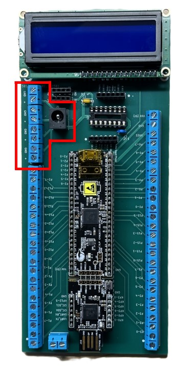

{: .fs-2 }
This document was last modified: <scr id="demo">.

# Lab 1: Hello Controller
{: .no_toc }

## Table of contents
{: .no_toc .text-delta }

1. TOC
{:toc}

---

## Lab Objectives

1.	Ensure that you are ready to use the Robotic System`s mock Controller unit, which uses PSoC 5LP
and an LCD Screen, for many of the lab assignments.
2.	Get you started with some coding on the PSoC controller.

## Deliverables

- [ ] <ins>In-class demonstration</ins>, using your completed "controller" indicated by writing your name on
    the back side of the PCB, display your name in the top left corner of the LCD screen
    and towards the bottom right corner of the LCD screen, you have “Count:” with values counting up by ones.

- [ ] <ins>In-class demonstration</ins> of the PSoC`s built-in LED blinking.  

- [ ] <ins>A Canvas submitted</ins> of the Lab`s PSoC Creator archived/zipped file for this lab.

{: .warning-title}
> Warning
>
> <Strong><ins>To be eligible</ins></strong> to receive credit for the code submission,
> you <strong><ins> must receive Demonstration credit.</ins></strong>

## General Steps for Completion of Lab

### Step 1 - Double Check Parts 

To Hide Details

The following table lists the parts, quantities, and PCB 
designators. <strong>Figure 1</strong> shows a view of most of the parts needed to build mock controller 
for the Robotic Systems courses.

| QTY  | Part Name                     |PCB designator(s) |
|:------|:-----------------------------|:-----------------|
| 1     | Custom PCB                   |                  |
| 2     | 40 pin Female Header         | U1               |
| 14    | 4 pole Screw Header          | J1 (6.5x), J2(2x),  J9 (5x), J8 (0.5x)              |
| 1     | DC Power Jack                | J6               |
| 1     | 16 pins IC Socket            | U2               |
| 2     | 6 pin Female Header          | J11, J12         |
| 1     | 0.1 uF Capacitor (104)       | C1               |
| 1     | 1 uF Capacitor (105)         | C2               |
| 2     | 4 pin Female Header          | J7, J10          |
| 1     | 16 pin Female Header         | U3               |
| 2.5   | 40 pin Male Header           |                  |
| 1     | PSoC 5LP Development Kit     |                  |
| 1     | Basic 16x2 Character LCD     |                  |
| 5     | Bumper Pads     |  ** To provide protection for accidental shorts and/or scratches from PCB   |
| 4     | Socket Head Screw  M2.5, 14 mm Long     | ** Use to attach LCD Screen to PCB if so desired. |
| 8     | M2.5 Nylon Hex Nut    | ** Use to attach LCD Screen to PCB if so desired.   |

<figure>
    
    <figcaption><strong>Figure 1:</strong> Parts needed to build mock controller.</figcaption>
</figure>  

### Step 2 - Solder Parts

To Hide Details

Solder the different parts on to build your "Controller," similar to what is shown in <strong>Figure 2.</strong> See below for more details and steps.

<figure>
    
    <figcaption><strong>Figure 2:</strong> Showing the completed mock controller.</figcaption>
</figure>

{: .new-title}
> TIPS
> <ul>
>   <li> When soldering through-hole parts, it is commonly recommended that solder 
>   parts be attached in order of smallest height to largest.</li>
>   <li> Place/work with parts to help keep the PCB “level” to help keep parts tight to the board.</li>
>   <li> Solder one (or two, if needed) to hold the part in place so you can inspect and
>   correct the positioning before soldering all the pins.</li>
>   <li> Both the pad and pin need to get hot so that the solder flows and bonds correctly.</li>
>   <li> Too much heat for the type of solder can ruin the solder joint(s).</li>
>   <li> When part alignment matters, place all the parts and then solder a few pins to hold the 
>   alignment. Then, if applicable, separate into a sub-group before finishing the soldering
>   of the remaining pins. Check and be careful not to mess up that alignment.</li>

Using the tip from above, it is recommended that you add parts in the following order:
1.	Capacitors (<strong>Figure 3</strong> for refernce shown farther below)
2.	Dip socket (<strong>Figure 4</strong>)
3.	Female and male headers at U1 (PSoC) (<strong>Figure 5</strong>)
4.	Remaining female headers at J7, J10, J11, J12, and U2. (<strong>Figure 6</strong>)
5.	Screw headers, connected together at J1 and J9.
6.	Remaining screw headers
7.	DC Power Plug
8.	Male header to LCD screen
9.	Bumpers on the back side of PCB.

{: .warning-title}
> Attention!
>
> Make sure the opening on the side of the screw terminals are
> facing out, away from PCB, to make it easy to secure wires later.
> (<strong>Figure 7</strong> for refernce shown farther below)

<figure>
    
    <figcaption><strong>Figure 3:</strong> Showing the placement of capacitors.</figcaption>
</figure>
 
<figure>
    
    <figcaption><strong>Figure 4:</strong> Showing the placement of dip socket.</figcaption>
</figure> 
 
<figure>
    
    <figcaption><strong>Figure 5:</strong> Showing male and female headers held in alignment with PSoC Dev board.</figcaption>
</figure>
 
<figure>
    
    <figcaption><strong>Figure 6:</strong> Showing remaining female header.</figcaption>
</figure>
 
<figure>
    
    <figcaption><strong>Figure 7:</strong> Attempting to Show how the wire openings on the screw termials are facing out.</figcaption>
</figure>
 

### Step 3 - Inspection of Work

To Hide Details

If you haven`t been doing it already, now is the best time to inspect your work on
assembling your “Controller.” Things you are on the lookout for are:
<ul>
    <li> Missed parts. Look for parts you may have forgotten to either add or fully solder.
    The only opening that will not have something soldered to it are the non-plated mechanical
    holes for the screws to mount/secure the LCD screen.</li>

    <li> Quality of soldered joints. Look at all the points you soldered. (a) Do they have 
    the appearance of a slightly melted Hersey kiss? This means that the solder flows in a smooth
    cone-like shape. See <strong> Figure 8</strong> and look at the solder joint the Green arrows
    are pointing to for reference. Or look at the solder joints back in <strong>Figure 7. </strong>
    You <strong><ins>do not want balls</ins> of solder at the pins</strong> like the what the
    <strong> RED arrows</strong> are pointing to in <strong>Figure 8.</strong> </li>

    <li> Check continuity. While inspecting your solder joints, are there places you 
    are <strong> not certain</strong> they are either (a) making a connection or (b) could be 
    shorting? Now is the time to make sure you will not have problems later. </li>
</ul>

<figure>
    
    <figcaption><strong>Figure 8:</strong> Attempting to show how to check solder joint quality where 
    the green arrows are what is desired.</figcaption>
</figure>

### Step 4 - Understanding Your Controller

#### Processor
{: .fs-4 .fw-500}

To Hide Details

Similar to an Industrial Controller Unit, your mock Robotic Syste's Controller
has a Processor which is our class is the PSoC 5LP which is within the Orange 
center box of <strong>Figure 9.</strong>  To protect our processor, the whole Dev board
is supported by header to help prevent the kit's programmer part from snapping/breaking 
off from the PSoC 5LP part. <strong>Figure 10</strong> shows those two sections and a pin overview of the PSoC 5LP. 

{: .warning-title}
> Warning!
>
> You can only program this Dev board on the one end with the male USB A 
> through the programmer section of the dev board.

<figure>
    
    <figcaption><strong>Figure 9:</strong> Highlighting the location of the processor with the orange box 
    and the in/output connector with the two red boxes.</figcaption>
</figure>
 
<figure>
    
    <figcaption><strong>Figure 10:</strong> PSoC 5LP pin overview and section.</figcaption>
</figure>

#### Inputs and Outputs
{: .fs-4 .fw-500}

To Hide Details

Again, like an Industrial Controller Module, the different
Input and Output that goes to the processor have a separate connection for
easy and secure points of connection. Thess are in located in the red boxes of 
<strong> Figure 9.</strong> The only I/O pins for the PSoC 5LP not on these screw terminal blocks 
are the ones going to the LCD screen.

#### Shared Processor Power Levels
{: .fs-4 .fw-500}

To Hide Details

asdfghjkl

<figure>
    
    <figcaption><strong>Figure 11:</strong> The yellow box indicates a point of connection for multiple 5 volts and ground connections.</figcaption>
</figure>

#### Motor Driver Unit
{: .fs-4 .fw-500}

To Hide Details

asdfghjkl

<figure>
    
    <figcaption><strong>Figure 12:</strong> The orange box indicates the motor driver unit area.</figcaption>
</figure>

#### Motor Power
{: .fs-4 .fw-500}

To Hide Details

asdfghjkl

<figure>
    
    <figcaption><strong>Figure 13:</strong> The red box area indicates where the higher motor power comes in and is accessed.</figcaption>
</figure>

#### User Interface Screen
{: .fs-4 .fw-500}

To Hide Details

asdfghjkl

<figure>
    
    <figcaption><strong>Figure 14:</strong> The red box area indicates where a display screen can be connected.</figcaption>
</figure>

### Step 5

To Hide Details

To make it easier to connect the motor and encoder wires to the controller, it is <strong>strongly suggested</strong> that you <ins>solder six
of your jumper wires</ins> to each of the wires of the motor wire harness, similar to what is shown in <strong>Figure 1:</strong>.

### Step 6

To Hide Details

To make it easier to connect the motor and encoder wires to the controller, it is <strong>strongly suggested</strong> that you <ins>solder six
of your jumper wires</ins> to each of the wires of the motor wire harness, similar to what is shown in <strong>Figure 1:</strong>.

### Step 7

To Hide Details

To make it easier to connect the motor and encoder wires to the controller, it is <strong>strongly suggested</strong> that you <ins>solder six
of your jumper wires</ins> to each of the wires of the motor wire harness, similar to what is shown in <strong>Figure 1:</strong>.

### Step 8 - Prep the DC Motor Wire Harness.

To Hide Details

To make it easier to connect the motor and encoder wires to the controller, it is <strong>strongly suggested</strong> that you <ins>solder six

