{: .fs-2 }
This document was last modified: <scr id="demo">.

<script>
let text = document.lastModified;
document.getElementById("demo").innerHTML = text;
site.last_edit_timestamp= text;
</script>

# Lab 2: Finding DC Motor Constant Values
{: .no_toc }

## Table of contents
{: .no_toc .text-delta }

1. TOC
{:toc}

---
## Lab Objective

Ensure that you can control a DC motor speed and reinforce the subject matter covered in the lecture on "DC Motors and Encoders."

## Deliverable

- [ ] <ins>In-class demonstration</ins> with the LCD screen displaying a reading of the RPM/speed from one of the many runs used in finding the motor velocity constant (K<sub>V</sub>).

- [ ] <ins>In-class demonstration</ins> with the LCD screen displaying the RPM/actual speed for your torque load and being able to tell what your predicted speed for that torque rating.  

- [ ] <ins>A Canvas submitted</ins> document that contains the following items:

    - [ ] The calculation and result for figuring out your Count Per Revolution (CPR).
    
    - [ ] The steps for finding the motor velocity constant (K<sub>V</sub>) via a single reading.
    
    - [ ] Table and graph for finding the K<sub>V</sub> via a linear trendline fit.  
        * Table has a Title.
        * The table`s columns are labeled.
        * Graph has a Title.
        * Both graph axes are labeled, and unit values are given as needed.
        * A trendline that was formed from the points on the graph.
        * The trendline formula is shown along with the fit value of r<sup>2</sup>.

    - [ ] The method used to determine the linear line equation for Torque vs Speed.
        * If by equation, show the steps to calculate the equation.
        * If by trendline, show the graph for the Torque vs Speed along with the Table used to generate the graph.
        * The graph should include the title.
        * Both graph axes are labeled, and unit values are given as needed.
        * The trendline formula is shown along with the fit value of r2.
        * Show the reworked equation to have Torque as the input.
        * The mass or torque used to determine the predicted motor speed.
        * Compare the predicted and resulting motor speed for that torque load.


## General Step for Completion of Lab

### Step 1: Prep the DC Motor Wire Harness.
<details open markdown="block">
<summary>To Hide Details</summary>

To make it easier to connect the motor and encoder wires to the controller, it is <strong>strongly suggested</strong> that you <ins>solder six
of your jumper wires</ins> to each of the wires of the motor wire harness, similar to what is shown in <strong>Figure 1:</strong>.

{: .new-title}
> NOTE
>
>   * It would suggest using either the Male-to-Female or Female-to-Female jumper wires.
>   * Cut off the the Female connector and stripe the the end.
>   * If using heat-shirk to protect the wire connection, make sure it is on the wire <strong>before</strong> soldewring the wirwes together.
>   * To avoid confusion later, use jumper wires that have the <ins>same</ins> color.

<figure>
    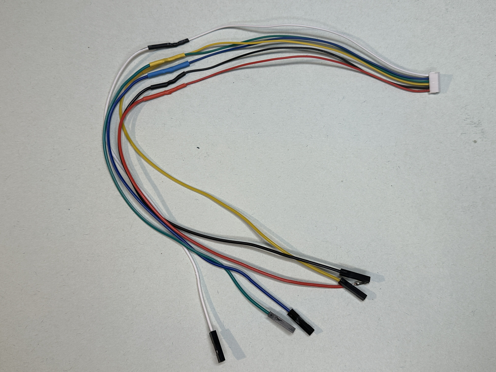
    <figcaption><strong>Figure 1:</strong> Example of extending DC motor`s wire harness.</figcaption>
</figure>

</details>

### Step 2 - Overview of the DC Motor
<details open markdown="block">
<summary>To Hide Details</summary>

6V 100-1 Micro Metal Gearmotor w/ Encoder & Cable, 150rpm

<figure>
    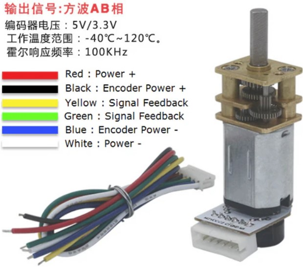
    <figcaption><strong>Figure 2:</strong> Overview of the DC Micro Metal Gearmotor with Encoder.</figcaption>
</figure>
<br>

{: .new-title}
> WIRING NOTES
>
>   * <strong>Power +</strong> and <strong>Power -</strong> goes
directly to the motor, and the way the polarity is connected determines the direction of rotation.
>   * <strong>Encoder Power +</strong> and <strong>Encoder Power -</strong> is for the encoder and is powered by the controller.
>   * The two feedback wires are the two channels of signal.

Encoders use a magnetic disc and hall effect sensors to provide 12 counts per revolution of the motor 
shaft. The sensors operate from 2.7 V to 18 V and provide digital outputs that can be connected directly
to a microcontroller or other digital circuit.

<strong> Specifications</strong>
<ul>
    <li> Rating Voltage: 6 V DC</li>
    <li> Operation Voltage: 1.5 to 12 V DC</li>
    <li> Gear Ratio: 1/100</li>
    <li> No Load Speed: 150 RPM</li>
    <li> No Load Current: 40 mA</li>
    <li> Rated Speed: 120 RPM</li>
    <li> Rated Torque: 0.35 Kg.cm</li>
    <li> Rated Current: 155 mA</li>
    <li> Stall Torque: 1.75 Kg.cm</li>
    <li> Stall Current: 0.55 A</li>
</ul>

<strong>Motor Source:</strong> <https://www.robotshop.com/products/e-s-motor-6v-1001-micro-metal-gearmotor-w-encoder-cable-150rpm>

</details>

### Step 3: Assembling the DC Motor for the Lab 
<details open markdown="block">
<summary>To Hide Details</summary>

Attach the DC motor to the torque lab bracket with two of the Pan-Head, Phillips Screws M1.6 x 0.35mm Thread, 4mm Long as shown in <strong> Figure 3.</strong>

<figure>
    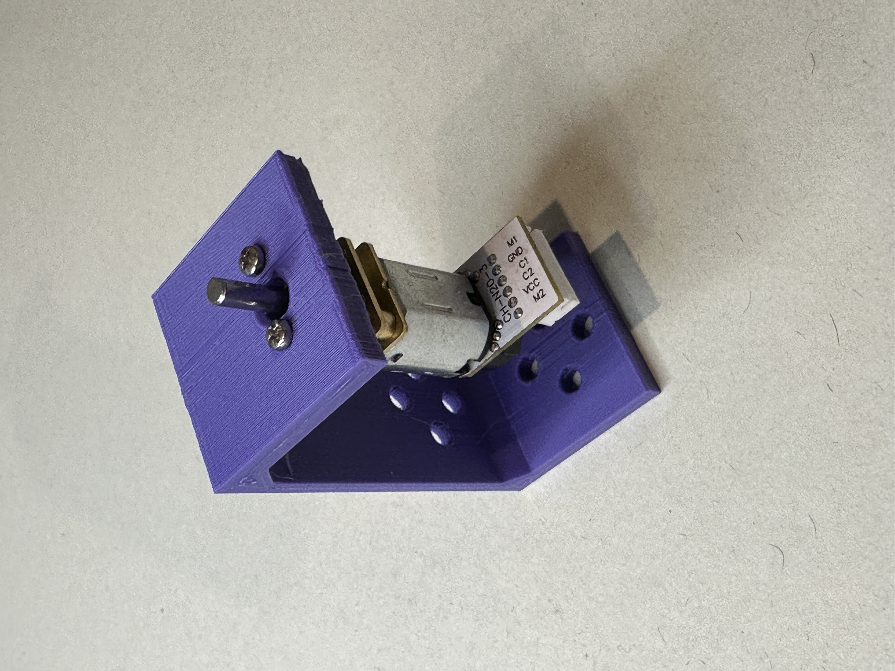
    <figcaption><strong>Figure 3:</strong> Attaching the DC motor with the two M1.6 - 4mm long screws to the torque lab base.</figcaption>
</figure>

Now, before attaching the mounting hub to the torque lab spool, position the non-looped side of the string so that the knot is either:
<ul>
    <li> Inside the recessed notch, as shown in <strong>Figure 4.</strong> (It will be fine if the knot is slightly above the surface.)</li>
    <li> Or going across the area where the mounting hub will be attached as shown in <strong>Figure 5.</strong></li>
</ul>

<figure>
    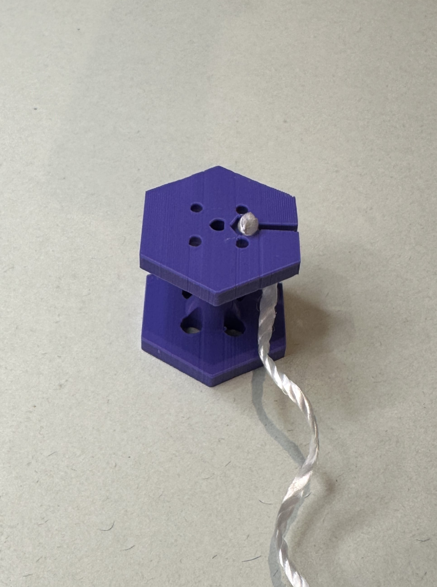
    <figcaption><strong>Figure 4:</strong> Showing the torque pull string knot held inside the recess.</figcaption>
</figure>
<br>
<figure>
    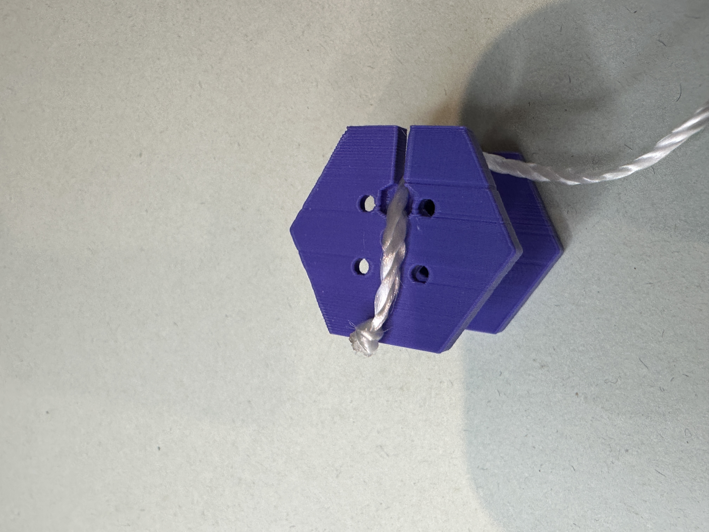
    <figcaption><strong>Figure 5:</strong> Showing the torque pull string knot across the hub location.</figcaption>
</figure>

{: .highlight-title}
> Suggestion 
>
> Before mounting the hub, it will be easier if you start threading one of the 4-40 set screws in the side threaded hole.


Attach the mounting hub to the torque spool with two to four Pan-Head, 2-56 Thread, 1/4 inch long, slotted screws. <strong>Figure 6</strong> shows
the positioning of the mounting hub capturing the torque string, and <strong>Figure 7</strong> shows that you will have to tighten the screws by passing
the screwdriver through the holes.

<figure>
    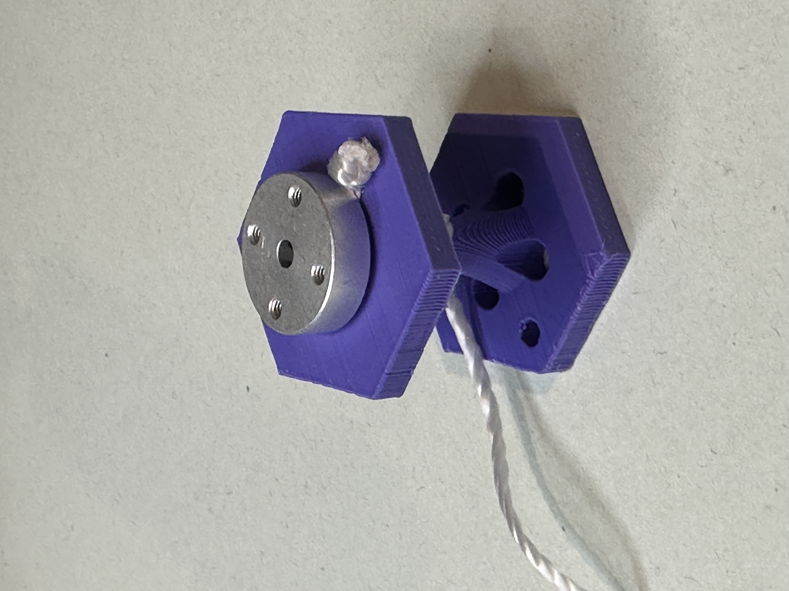
    <figcaption><strong>Figure 6:</strong> Showing the position of the mounting hub to the torque spool.</figcaption>
</figure>
<br>
<figure>
    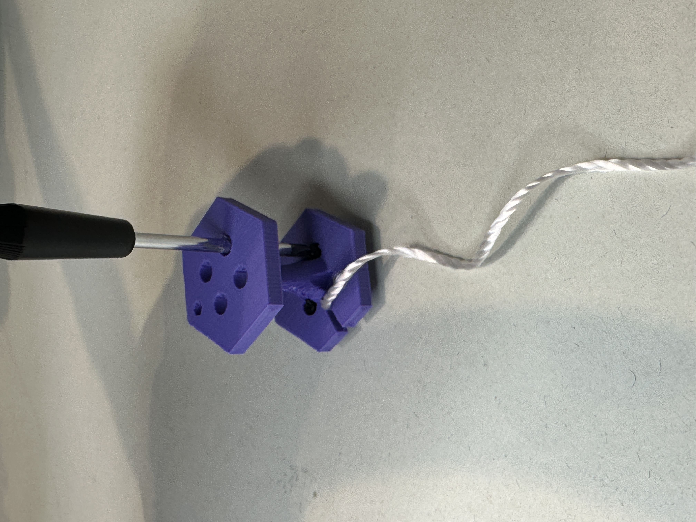
    <figcaption><strong>Figure 7:</strong> Showing how to gain access to tighten the screws.</figcaption>
</figure>

With the mounting hub attached to the spool, you now need to attach it to the shaft of the DC motor. To do this,
align the flat section of the "D" part of the shaft with the #4-40 set screw. With the mounting hub clear of the
DC motor screws, tighten the set screw onto the flat section with the included Allen wrench. This is what is being
attempted to be shown in <strong> Figure 8.</strong>

<figure>
    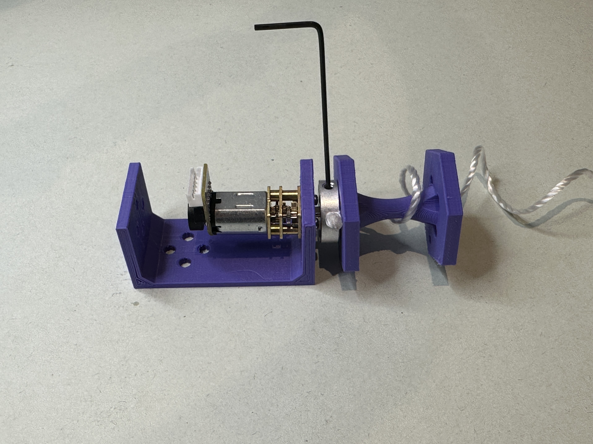
    <figcaption><strong>Figure 8:</strong> Showing how to position and tight the set screw onto the motor shaft.</figcaption>
</figure>

The last few things you will need to do will be to:
<ul>
    <li> Align and insert the motor wire harness into the socket on the motor.</li>
    <li> Connect the other ends for the encoder to the EGR "controller" per the way you assigned the pins in the upcoming steps. </li>
    <li> Consider winding the torque string around the spool so it is out of the way till later.</li>
</ul>

Your DC motor setup for this lab should look something like <strong> Figure 9.</strong>

<figure>
    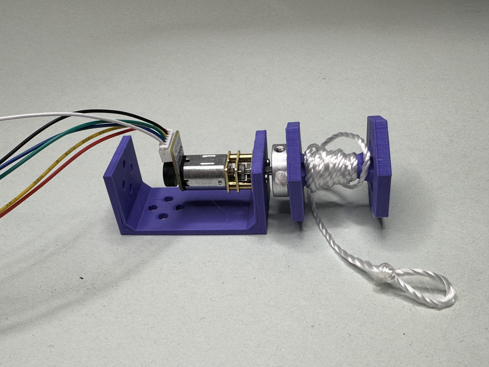
    <figcaption><strong>Figure 9:</strong> Showing the prepared motor for the motor torque lab.</figcaption>
</figure>

</details>

### Step 4: Setting Up the Motor Encoder in PSoC Creator 
#### Setup and Component Module Setup
{: .fs-4 .fw-500}

<details open markdown="block">
<summary>To Hide Details</summary>

<ul>
    <li> In your Robotic I workspace, create a new project for this lab.</li>
    <li> Add the “Quadrature Decoder” and “Character LCD” component modules to the “TopDesign.” 
    <strong>Figure 10</strong> shows the placing of these modules into the “Topdesign” area.</li>
</ul>

<figure>
    
    <figcaption><strong>Figure 10:</strong> Showing the insertion of the “Quadrature Decoder” and "Character LCD" modules.</figcaption>
</figure>

<ul>
    <li> <strong>Figure 11</strong> shows the settings inside the “Quadrature Decoder” component module on the "Counter Size" tab. The follow are the different settings on the differnt tabs.</li>
    <ul>
        <li> <strong>Counter Size tab:</strong> select 32 bit because we have lots of memory space to hold a large count values.</li>
        <li> <strong>Counter Resolution tab:</strong> select “4x” because it will give a count for each change in state in any combination for both hall effector sensors.</li>
        <li> <strong>Use Index Input tab:</strong> make sure the “Use index input” is unselected because this encoder does not have a indexing signal.</li>
        <li> <strong>Enable Glitch Filtering tab:</strong> turn on/check.</li>
        <li> <strong> Built-in tab:</strong> there is nothing to add or select.</li>
    </ul>
</ul>

<figure>
    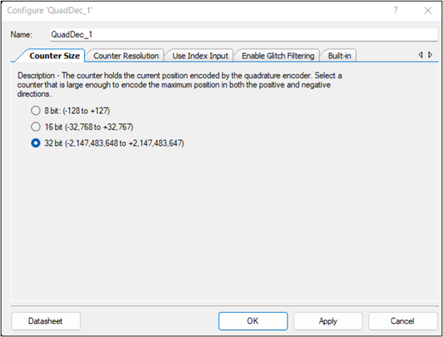
    <figcaption><strong>Figure 11:</strong> Showing the settings on the "Counter Size" tab inside the "QuadDec" module.</figcaption>
</figure>

<ul>
    <li> Add two digital input pins, one for each encoder output to go into “quad_A” and “quad_B.”</li>
    <ul>
        <li> Name each pin to a helpful value (i.e. C1 and C2 or A and B)</li>
        <li> The default settings remain.</li>
        <ul>
            <li> Drive mode: “High impedance digital”</li>
            <li> Initial drive state: “Low (0)”</li>
            <li> “HW connection”</li>
        </ul>
    </ul>
    <li> Add a clock pin to the “QuadDec” clock.</li>
    <li> With the component module placed, the pins can be assigned. For the LCD component module, you will select an array of 7 pins (P2[6:0]).
    For the encoder`s first counter switch, C1, select P1[5], and for the second counter switch, C2, select P1[6], as shown in <strong>Figure 12</strong>.</li>
    <li> Connect the encoder`s ground line (“blue”) to the PSoC ground.</li>
    <li> Connect the encoder`s power line Vcc (“black”) to the the PSoC Vdd power.</li>
</ul>

<figure>
    
    <figcaption><strong>Figure 12:</strong> Showing the pin selection for the “LCD_Char_1” and the two encoder switches C1 and C2.</figcaption>
</figure>


#### Basic Encoder Code for the "main.c" file.
{: .fs-4 .fw-500}

Follow is the basic code to start working with the encoder.

<div class="code-example" markdown="1">
```c
//Basic code to start working with the encoder.
#include "project.h"

int main(void)
{
    int count; //to hold the count value
    
    CyGlobalIntEnable;  //This is needed for the QuadDec
    QuadDec_1_Start();
    LCD_Char_1_Start();
    
    for(;;)
    {
        count=QuadDec_1_GetCounter();
        LCD_Char_1_ClearDisplay();
        LCD_Char_1_Position(0,0);
        LCD_Char_1_PrintNumber(count);
        CyDelay(50);
        
    }
} 
```
</div>

</details>

### Step 5: Find Your Count Per Revolution (CPR) 
<details open markdown="block">
<summary>To Hide Details</summary>

1.	After writing the code to the PSoC with the PSoC program to display the encoder`s count value,
rotate the spindle/hub to determine which way to turn it to get an increasing count value.
2.	Once you know which way to turn the spindle/hub, press the reset button to zero out the count.
3.	Now, carefully, and slowly rotate the spindle/hub 8 to 12 rotations.
    * To help track the complete revolution of the spool, use the hole that is near one of the
     corners of the hexagon in relation to a fixed point.
4.	Note the count value and the number of rotations.
5.	Divide the count value by the number of revolutions to get an average CPR.

</details>

### Step 6: Options to Control DC Motor Speed

There are three options to choose from to control the voltage level going to the DC motor, which
will determine the motor`s speed. Pulse width modulation (PWM) signals are used in Methods 1 and 2.
Method 1 uses the power from the PSoC controller, which limits the maximum voltage level to 5 volts
with half an amp. Method 2 uses the H-Bride and the power from the DC power plug, which raises the maximum
voltage level to 6 volts with a full amp. Finally, with Method 3, the limiting factor is the voltage 
rating of the DC motor since this method simply involves the use of one of the Benchtop DC Power supplies found in the lab. 
<strong>Choose the method that works best for you.</strong>

<details open markdown="block">
<summary>To Hide Details</summary>

####  Method 1: PSoC Power for PWM for DC Speed Control
{: .fs-4 .fw-500}

To get a varied measured output, a PMW rapidly turns on and off the voltage. The length of time 
the signal is on versus off will determine the perceived output voltage level. To accomplish this, you need to: 
1.	Add the Pulse Width Modulator (aka PWM [v3.3]) to the TopDesign page.
    - On the “Configure” tab:
        - Set the “PWM Mode” to “One Output.”
        - Set the “Period” to 100.
        - Set the "CMP Value 1" to 100.
    - The other tabs are left at default settings.
2.	Add a Logic Low pin to reset the connection of the PWM component module.
3.	Add a Clock component and connect it to the clock of the PWM component module.
    - Leave at the highest clock frequency so that the pulse width switches super-fast.
4.	Add a Digital Output pin and connect it to the pwm1 connection of the PWM module.
    - Rename the pin to something helpful (i.e. Motor PWM)
    - Make sure the “HW connection” is checked.
    - Initial drive state is “Low (0).”

See <strong>Figure 13</strong> for a visual refernce for these steps on the TopDesign page.

<figure>
    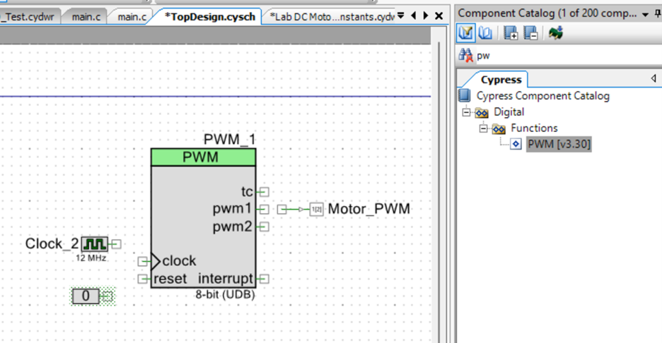
    <figcaption><strong>Figure 13:</strong> Captured image showing the different components just dropped into the TopDesign.</figcaption>
</figure>

5.	Now go to the pins under Design Wide Resources and connect the newly added Output pin to a PSoC controller pin. Something like P1[2].
6.	Connect one of the DC motor power wires to the PSoC`s Vdd pin, and the other motor power wire to the PWM output pin (like P1[2]).
7.	Now modify existing code to match or add the following code and change the compare value as needed to change the supplied voltage. (see code after the next step)
8.	To determine the voltage level the DC motor ran at, you subtract the “Campare” value from 100. Turn this into a percentage value. 
Then multiply this percentage value to the 5 volts (the voltage level off the PSoC). For example, if the compare value was set to 10, then:


<div class="code-example" markdown="1">
```c
// Code to use the PWM and encoder with the DC motor along with displaying speed on the LDC screen.
#include "project.h"

int main(void)
{
    int count1; //to hold the count value
    int count2;
    int countDifference;
    float cpr = 4222.0; // This should be your CPR value found earlier
    float speed;
    int Compare = 10; // 0 == full speed/pulse-wide and 100 == is off
    
    CyGlobalIntEnable; //This is needed for the QuadDec
    QuadDec_1_Start();
    LCD_Char_1_Start();
    PWM_1_Start();
   
    for(;;)
    {
        PWM_1_WriteCompare(Compare);
        QuadDec_1_SetCounter(0); // This resets the Encoder count to zero
        CyDelay(1000); // This delay is to allow time for the motor to get up to speed
        count1=QuadDec_1_GetCounter(); //Get first count value
        CyDelay(1000); //wait a know period of time
        count2=QuadDec_1_GetCounter(); //Get second count value
        countDifference=count2-count1;
        speed = (countDifference*60.0)/cpr; //See lecture notes if more info needed
        LCD_Char_1_ClearDisplay();
        LCD_Char_1_Position(0,0);
        LCD_Char_1_PrintNumber(Compare);
        LCD_Char_1_Position(1,0);
        LCD_Char_1_PrintNumber(speed);        
    }
}
```
</div>

####  Method 2: PSoC PWM for DC Speed Control Using External Power
{: .fs-4 .fw-500}

This method has the same PSoC setup and code as Method 1 <ins>except for two things</ins>:
<ol>

    <li> <strong>Now the compare of 100 == full speed/pulse-wide and 0 == is off </strong>.</li>
    <li> The wiring is different due to the H-Bride which results in providing more power to the motor.
    Use the following table to connect to the H-Bridge for this Lab setup. For the DC motor, the table
    indicates one of the motor power lead goes to "1Y." The other motor lead is connected to ground.</li>
</ol>

| H-Bridge<br>Pin Number  | H-Bridge<br>Pin Name  |Connection To |
|:---------|:---------|:-------------------------------------------------------|
| 1         | EN A (1,2) | PSoC PWM Speed Pin (P1[2] was suggested)               |
| 2         | 1A (DIR)         | PSoC V<sub>DD</sub> or a PSoC pin that goes high to turn on the motor and low to turn off the motor.  |
| 3         | 1Y         | Motor (One Lead)                                       |
| 8         | V<sub>CC2</sub>       | Positive power from DC wall Plug            |
| 4, 5, 12, 13 | Ground     | Ground (Done by PCB)                                   |
| 16        | V<sub>CC1</sub>       | V<sub>DD</sub> (Done by PCB)                             |
| 9         | EN B (3,4) | Not used in this non-directional example               |
| 6         | 2Y         | Not used in this non-directional example               |
| 7         | 2A         | Not used in this non-directional example               |
| 10        | 3A         | Not used in this non-directional example               |
| 11        | 3Y         | Not used in this non-directional example               |
| 14        | 4Y         | Not used in this non-directional example               |
| 15        | 4A         | Not used in this non-directional example               |

<strong>H-Bridge Source:</strong> <https://www.ti.com/lit/ds/symlink/sn754410.pdf?ts=1718345235534&ref_url=https%253A%252F%252Fwww.mouser.com%252F>

To determine the DC motor`s voltage level, you convert the “Compare” value into a percentage value. Then, multiply this percentage value
by the voltage value supplied to the motor (6 volts). For example, if the compare value was set to 90 with the 6-volt wall wart/power plug, then:


####  Method 3: External Power Supply
{: .fs-4 .fw-500}

This method only requires one to connect the DC motor to a DC power supply and carefully adjust the voltage levels. Remember,
 as you adjust the power supply output levels, these motors are rated for 6 V DC while having an operations range of 1.5 to 12 V DC.

</details>

### Step 7: Find the Velocity Constant (K<sub>V</sub>) Via a Single Reading

Find K<sub>V</sub> by using the velocity constant formula from the lecture notes, along with
a voltage level and the speed that was produced at that voltage level.

### Step 8: Find the Velocity Constant Via a Linear Trendline Fit

Run the DC motor at 9 different voltage levels. During each voltage level, collect three speed
values. Then, use the average of those speeds per voltage level to get nine points to create
a linear graph, which is Speed vs Voltage.

### Step 9: Compare Predicted Motor Speed to Achieved Speed for a Given Torque Load 

Using the Stall torque, No-Load Speed, and voltage rating for the kit`s DC motor found in the [Step 2: Overview of the DC Motor](#step-2---overview-of-the-dc-motor) section,
create a linear equation for Torque versus Speed. The linear equation can be found either:
<ul>
    <li> Creating a Torque versus Speed scatter plot using only the Stall torque and No-Load Speed from the motor specifications. Then, add a trendline to get a linear sloped equation.</li>
    <li> Use the linear sloped equation to find this equation using only the Stall torque and No-Load Speed from the motor specifications.</li>
</ul>
This equation will find the torque load the motor can handle at the given speed input. Rearrange the equation so that the Torque load
is now the input, and the output is the speed. Use this new formula to predict the speed for a torque load force of your choice. To 
produce this torque force, use the spool dimension shown in <strong>Figure 14</strong> to determine the lever arm length and some weight arrangement that varies
somewhere between one kilogram and 100 grams, in increments of 100 grams. You will hook this weight configuration onto the end of the torque string. 
<ins>Run the motor at the <strong>rated voltage level</strong> and display the speed of the motor <strong>under load</strong> on the LCD screen.</ins>

{: .warning-title}
> LIMITED WEIGHT SETS
>
> There is a limited number of One kilogram weight sets that has to be shared. 
>   1. Please only take a set when you are ready to use it.
>   1. <strong>Do not remove from classroom.</strong> There are multiply class section.

<figure>
    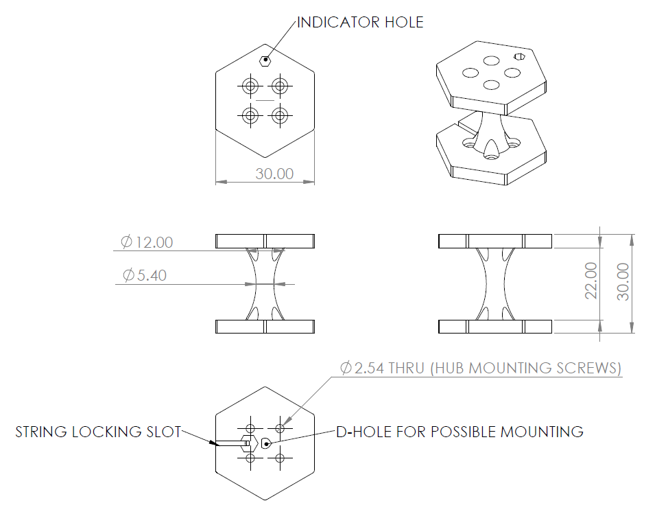
    <figcaption><strong>Figure 14:</strong> Dimensional drawing of the Torque Spool.</figcaption>
</figure>
